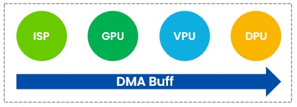
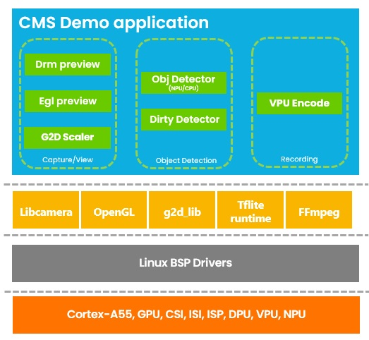
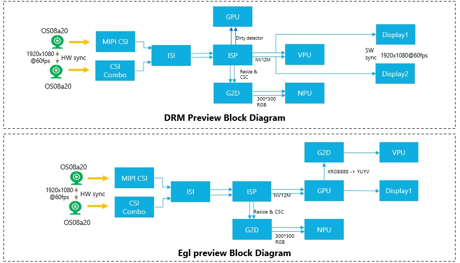
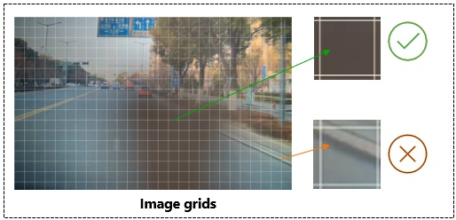
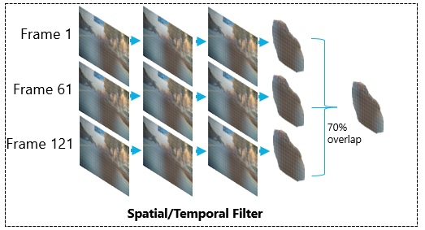
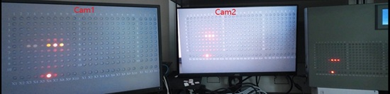
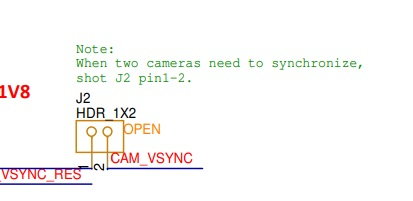
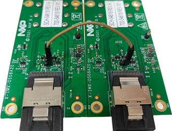

# i.MX95 CMS Demo
<!----- Boards ----->
[](./BSD_3_Clause.txt) [](https://www.nxp.com/products/processors-and-microcontrollers/arm-processors/i-mx-applications-processors/i-mx-9-processors/i-mx-95-applications-processor-family-high-performance-safety-enabled-platform-with-eiq-neutron-npu:iMX95)
 

This is a suite of libcamera-based camera applications optimized for NXP platforms. This implementation demonstrates a Camera Monitoring System (CMS) on the NXP i.MX95 EVK with dual-camera support, ultra-low latency display, and advanced lens contamination detection.

## 1. Background: What is a Camera Monitoring System (CMS)?

A Camera Monitoring System (CMS) is an advanced automotive technology that replaces traditional side-view and rear-view mirrors with high-resolution cameras and in-vehicle displays. CMS offers several advantages over conventional mirrors:
- Expanded Field of View: Reduces blind spots and improves scene coverage.
- Improved Aerodynamics: Reduces vehicle drag, improving fuel efficiency.
- Better Visibility: Performs well in low-light conditions and adverse weather.
- Advanced Features: Supports object detection, lane departure warnings, and contamination detection.
- Compact Design: Reduces vehicle width and improves maneuverability.


## 2. CMS Demo Overview

The CMS demo, built on the NXP i.MX95 EVK, delivers real-time vision performance with dual OS08A20 cameras capturing 1080p at 60 fps. The cameras are frame-synchronized and each drives its own display, achieving an ultra-low latency of just 50–60 ms from capture to output.

### Key Features

| Feature | i.MX95 EVK |
|---------|------------|
| **Dual Camera Support** | OS08A20 |
| **Max Resolution** | 1080p @ 60fps |
| **Frame Synchronization** | Hardware-sync |
| **End-to-End Latency** | 50-60ms |
| **Dual Display Output** |  Independent |
| **Preview Modes** | EGL, DRM |
| **Video Encoding** | H.264/H.265 (VPU) |
| **MP4 Container** | Optional |
| **Object Detection** | CPU/NPU (SSD) |
| **Lens Contamination Detection** | OpenCL-accelerated |
| **Image Processing** | G2D Hardware |
| **Zero-Copy DMA Buffer** | ISP/GPU/DPU/VPU |

Unified DMA buffer shared across ISP/GPU/DPU/VPU — no memcpy, no format conversion. Optimize hardware performance to its fullest potential.

  


## 3. Hardware Requirements

| Board Name | Quantity | Descriptions |
|------------|----------|--------------|
| [IMX95LPD5EVK-19](https://www.nxp.com/design/design-center/development-boards-and-designs/IMX95LPD5EVK-19) | 1 | i.MX95 19x19 EVK evaluation board |
| [IMX-OS08A20](https://www.nxp.com/part/IMX-OS08A20) | 2 | OS08A20 camera module |
| [IMX-LVDS-HDMI](https://www.nxp.com/part/IMX-LVDS-HDMI) | 1 or 2 | If HDMI monitor is connected through LVDS interface |
| [IMX-MIPI-HDMI](https://www.nxp.com/part/IMX-MIPI-HDMI) | 1 or 2 | If HDMI monitor is connected through MIPI DSI interface |

**Note:** For dual display output, you can use either LVDS or MIPI DSI interfaces, or a combination of both, depending on your display configuration.

## 4. Software Overview

Information         | Value
---                 | ---
i.MX BSP  			| [LF-6.18.2-1.0.0](https://www.nxp.com/design/design-center/software/embedded-software/i-mx-software/embedded-linux-for-i-mx-applications-processors:IMXLINUX?tab=Documentation_Tab)


### System Architect:
 
  

  

>**NOTE:** FFmpeg is used for MP4 video encoding; it is optional and can be removed.

### Optional Dependencies for MP4 Video Encoding

**Important**: The following FFmpeg libraries may **NOT be included** in the default Yocto release:

- libavcodec.so.*
- libavformat.so.*
- libavutil.so.*
- libswresample.so.*

#### Option 1: Deploy FFmpeg Libraries from Yocto SDK (Recommended)

If you have the Yocto SDK installed, copy the libraries to your target board:

**Example:**
```bash
scp ${SDK_PATH}/sysroots/armv8a-poky-linux/usr/lib/libavformat.so* root@ip_address:/usr/lib/
```

#### Option 2: Build Without MP4 Support (Raw H.264 Only)

If you only need raw H.264 output and want to avoid FFmpeg dependencies, you can disable MP4 muxing in preview/CMakeLists.txt.

#### Option 3: Build FFmpeg in Yocto Image


## 5. Build Instructions

### Install Dependencies

```bash
source $SDK
```

### Build the Project

```bash
mkdir build && cd build
```

```bash
cmake ..
```

```bash
make -j$(nproc)
```
### Deploy and Execute the Binaries

Copy the required binaries to the target i.MX95 EVK:

```bash
scp libcamera_CMS          root@ip_addr:/root/
scp preview/libpreview.so  root@ip_addr:/usr/lib/
scp core/libcamera_app.so  root@ip_addr:/usr/lib/
scp ../preview/models/*    root@ip_addr:/root/
```

Set up the environment and execute the application:

```bash
export LIBCAMERA_PIPELINES_MATCH_LIST='nxp/neo,imx8-isi,uvc'
systemctl stop weston*
./libcamera_CMS -n 2 -p 0 -d 0
```

### Reduce the buffer size
The default buffer count is 8. Reduce it to 4 by modifying:

```bash
vi /usr/share/libcamera/pipeline/nxp/neo/config.yaml
```

## 6. Usage

### Basic Single Camera Mode

```bash
./libcamera_CMS -n 1 -p 0 -d 0
```

This runs with one camera using EGL preview, no object detection.

### Dual Camera CMS Mode

```bash
./libcamera_CMS -n 2 -p 0 -d 0
```

This runs with two synchronized cameras using EGL preview.

### With Object Detection

```bash
# CPU-based detection
./libcamera_CMS -n 2 -p 1 -d 1

# NPU-based detection (faster)
./libcamera_CMS -n 2 -p 1 -d 2
```

### Command Line Arguments

```
Usage: ./libcamera_CMS [options]

Camera Options:
  -n, --num-cameras <N>      Number of cameras (1 or 2, default: 1)
  -p, --preview <TYPE>       Preview type (0=EGL, 1=DRM, default: 0)
  -d, --detector <TYPE>      Detector type:
                               0 = None (default)
                               1 = CPU detection (SSD MobileNet)
                               2 = NPU detection (SSDLite)
                               3 = Dirty detection
Recording Options:
  -r, --record               Enable video recording
  -o, --output <FILE>        Output file (default: output.mp4)
                             For dual camera: output_cam1.mp4, output_cam2.mp4
  -c, --codec <CODEC>        Video codec (h264/h265, default: h264)
  -b, --bitrate <RATE>       Bitrate in bps (default: 8000000)

Other Options:
  -v, --verbose              Enable verbose output
  --help                     Display this help message
```

## 7. Lens Contamination Detection (Dirty Detection)

### Overview

The dirty detection system uses OpenCL-accelerated image processing to identify lens contamination (dirt, dust, water droplets, etc.) in real-time. It employs a multi-stage filtering pipeline to distinguish actual contamination from normal scene elements like walls, ceilings, or shadows.
It divides the image into 64x64 pixel grids, and compute per-grid metrics:
- Contrast: Difference between the brightest and darkest pixels in the grid.
- Gradient: Average edge strength.
- Brightness: Average Y value.

  

### Temporal Stability Tracking

The temporal stability filter uses a sophisticated region matching algorithm:

  

## 8. Results

### Demo Output

The following image shows the CMS demo running in dual-camera mode with DRM preview:




## 9. Troubleshooting

### FFmpeg Library Not Found

**Error:**
```
./libcamera_CMS: error while loading shared libraries: libavcodec.so.61: cannot open shared object file
```

**Solution:**
1. Copy libraries from Yocto SDK (see "Deploy FFmpeg Libraries" above)

## 10. Known Issues

### Frame synchronization
The sensor driver was modified to enable dual camera frame synchronization.
Different BSP versions may require different implementation approaches.

```
@@ -875,7 +876,44 @@ static int ox05b1s_apply_current_mode(struct ox05b1s *sensor)
 				      sensor->mode->reg_data_count);
 	if (ret)
 		goto out;
+	if (sensor->i2c_client->adapter->nr == 1) {
+       //set the register settings:
+       //Master setting
+		(0x3002, 0x80);(0x3009, 0x06);(0x377e, 0x08);(0x3818, 0x03);
+		(0x3819, 0xc8);(0x381a, 0x04);(0x381b, 0xa0);(0x3823, 0x08);
+		(0x3824, 0x00);(0x3825, 0x20);(0x3826, 0x00);(0x3827, 0x08);
+		(0x3832, 0x22);(0x3834, 0xf4);(0x3842, 0x00);
+	}
+	else {
+       //Slave setting
+		(0x3002, 0x00);(0x3009, 0x02);(0x377e, 0x0a);(0x3818, 0x00);
+		(0x3819, 0x00);(0x381a, 0x00);(0x381b, 0x01);(0x3823, 0x50);
+		(0x3824, 0x03);(0x3825, 0xc8);(0x3826, 0x04);(0x3827, 0xa0);
+		(0x3832, 0x02);(0x3834, 0x04);(0x3842, 0x00);
+	}
``` 
Additionally, the J2 pin 2 of both camera modules must be connected together.





## 11. Release Notes

Version | Description                         | Date                           | tag
---     | ---                                 | ---                            | --- 
1.0.0   | Initial release                     | June 2026                      | cms_v1.0.0


## Licensing

*CMS* is licensed under the [BSD_2_Clause](./LICENSE.txt).
```

## Acknowledgments

This project is based on:
- **libcamera-apps** by Raspberry Pi Foundation
- **libcamera** by the libcamera project
- **TensorFlow Lite** by Google
- **OpenCV** by OpenCV Foundation

Special thanks to:
- Raspberry Pi Foundation for the original libcamera-apps
- The libcamera community for the excellent camera framework

## Contact and Support

### Resources

- **NXP i.MX95 Documentation**: https://www.nxp.com/imx95
- **libcamera Documentation**: https://libcamera.org/
- **TensorFlow Lite**:  https://www.tensorflow.org/lite
- **OpenCV Documentation**: https://docs.opencv.org/

---

**Last Updated:** June 2026  
**Version:** 1.0.0  
**Maintainer:** NXP Semiconductor
```
